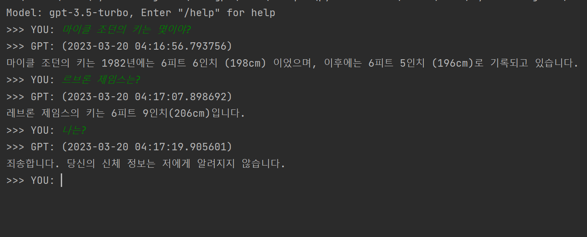

A simple cli demo program based on OpenAI GPT-3.5 Turbo API



## Getting started
## Mac OS
Download `dist/gpt` file.

Open terminal, go to the path you downloaded.

Run `gpt` with an argument: OpenAI API Key.
```commandline
./gpt <YOUR_OPENAI_API_KEY>
```

## Windows
Download `dist/gpt.exe` file.
```commandline
./gpt.exe <YOUR_OPENAI_API_KEY>
```

## Python project

#### Setup Environment
Copy & paste your OpenAI API Key on `.env`
```commandline
OPENAI_API_KEY="sk-***************************************"
```

#### Install dependencies
```commandline
pip install -r requirements.txt
```

#### Run!
```commandline
python main.py
```


## How to get an OpenAI API KEY
https://platform.openai.com/account/api-keys


## Tips
```commandline
alias gpt3='/path/your/project/dist/gpt sk-**********************'
```